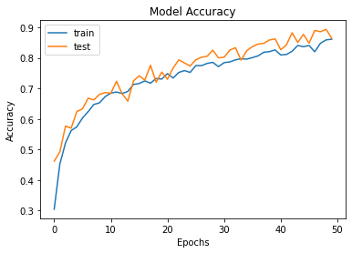

# Flowers-Recognition
#### CNN for recognizing different qualities of flowers.  

[Flowers Recognition](https://www.kaggle.com/alxmamaev/flowers-recognition) dataset used in this project.  

The biggest challenge was finding an efficient way to minimize loss and validation loss, the model was overfitting, even tho the network was as simple as it could be. I manage to improve it by adding data augmentation, and actually increasing the network's complexity.  

Afterwards, it was just a matter of finding the right amount of layers, neuron density, the optimizer (Adam AMSGrad with a learning rate of 0.001 proved to be very efficient), and so on.  

